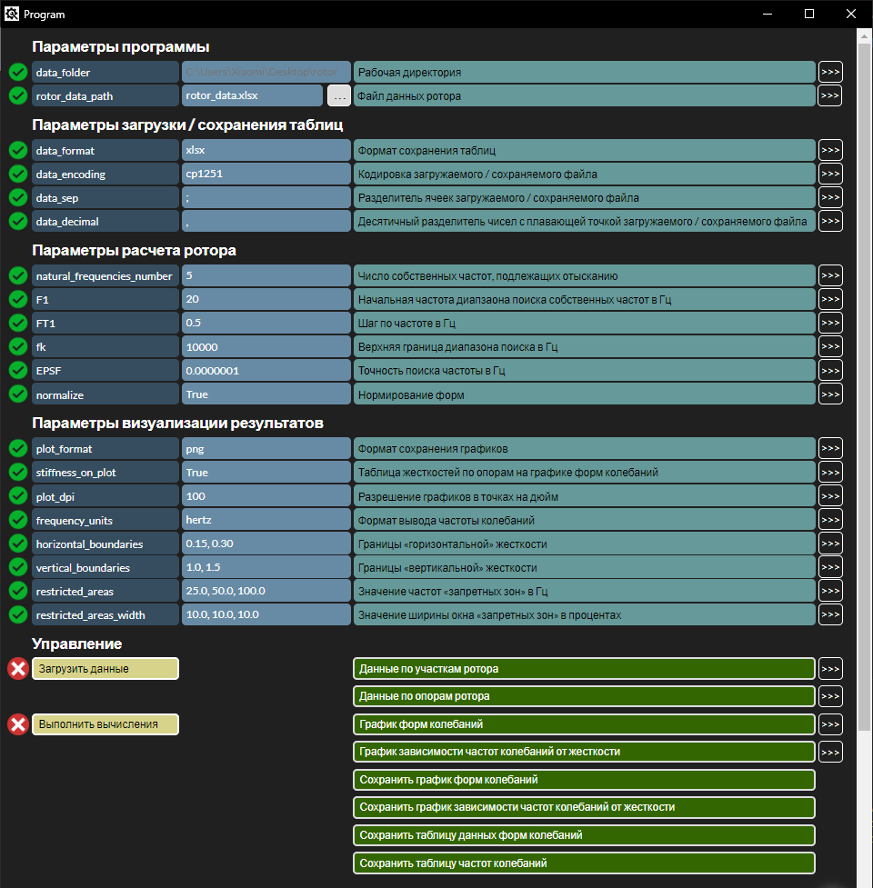

Программа расчета собственных частот валопровода
==============================

Описание программы:
------------
Данная программа реализует метод начальных параметров, что позволяет произвести оценку [собственных частот](https://ru.wikipedia.org/wiki/%D0%9D%D0%BE%D1%80%D0%BC%D0%B0%D0%BB%D1%8C%D0%BD%D1%8B%D0%B5_%D0%BA%D0%BE%D0%BB%D0%B5%D0%B1%D0%B0%D0%BD%D0%B8%D1%8F) и форм собственных колебаний консервативной модели [валопровода](https://ru.wikipedia.org/wiki/%D0%92%D0%B0%D0%BB%D0%BE%D0%BF%D1%80%D0%BE%D0%B2%D0%BE%D0%B4).

Вычислительное ядро реализовано на языке python3.8, графический интерфейс на языках html, js, css, для взаимодействия исполльзована библиотека python [eel](https://pypi.org/project/Eel/). 

Файл [rotor_data.xlsx](rotor_data.xlsx) содержит пример конфигурации валопровода, который может быть использован в качестве шаблона.

Файл [params.csv](params.csv) содержит пример расчетных параметров программы, которые используются как значения "по-умолчанию" при запуске программы.

Результаты вычислений сохраняются в папку **result**, которая создается в области рабочей директории.

Работа графического интерфейса возможна только в браузере [Google Chrome](https://www.google.com/intl/ru_ru/chrome/) актуальной версии.

Для запуска используется **localhost** на порту **8000**.
____

Общий вид графического интерфейса
------------

_____

Сборка exe-файла: 
------------
~~~
pyinstaller --onefile --noconsole --icon=.\engineer.ico --paths=.\.venv\Lib\site-packages --add-data=".\web;.\web" main.py
~~~

_____

Project Organization
------------

    ├── README.md
    ├── requirements.txt
    ├── main.py
    ├── main.exe
    ├── main.spec
    ├── engineer.ico
    ├── params.csv
    ├── rotor_data.xlsx
    │
    ├── lib
    │   ├── __init__.py
    │   ├── calculating_functions.py
    │   ├── forms.py
    │   └── varibales.py
    │ 
    ├── web
    │   │
    │   ├── templates
    │   │   ├── main.html
    │   │   └── base.html
    │   │
    │   └── static
    │       │
    │       ├── js
    │       │
    │       ├── img
    │       │   ├── success.png
    │       │   ├── error.png
    │       │   └── init.png
    │       │
    │       └── css
    │           └── style.css
    │
    └── .gitignore

------------
